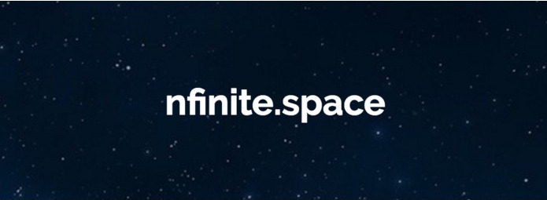
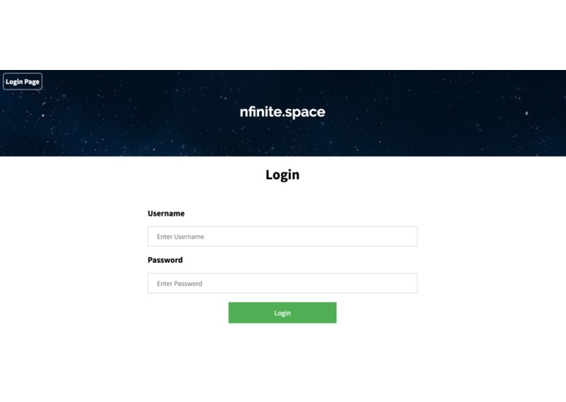
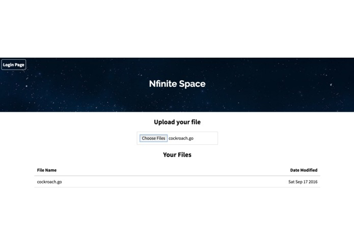

# Nfinite.space
### Give a little, get a lot

Nfinite.space is a cloud storage service that does things differently. In exchange for a small amount of space on your disk, we'll give you much more space in the cloud. But here's the trick, we don't actually store your data. Our algorithms intelligently disassembles your files and distributes them to other users' computers, with some redundancy. 

Nfinite.space utilizes the latest technologies, such as [CockroachDB](https://www.cockroachlabs.com/), websockets, Go, and React. 

Nfinite.space won the "Best use of AWS" prize at [Hack The North](https://hackthenorth.com)! You can read more on the [DevPost page](http://devpost.com/software/nfinite-space).

Created by:
- [David Tsenter](http://www.davidtsenter.com/)
- [Daniel Prilik](http://prilik.ca/)
- [Stephen Melinyshyn](https://melinysh.me/)

